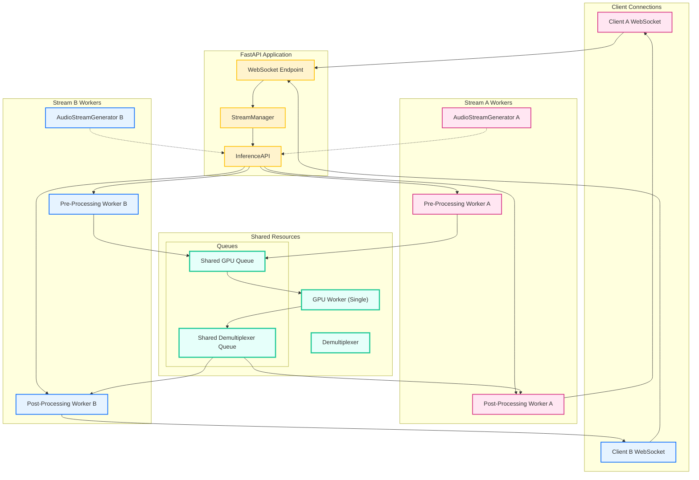

# Multi-Stream Inference Architecture

This document outlines the architecture of the multi-stream inference system, designed to handle multiple concurrent lip-syncing sessions efficiently and robustly.

## 1. Core Principles

The architecture is built on three core principles:

1.  **Resource Sharing**: Expensive resources, particularly the GPU and pre-loaded model weights, are shared across all concurrent streams to maximize hardware utilization and minimize memory footprint.
2.  **Stream Isolation**: Each stream operates independently with its own context, queues, and processing workers for CPU-bound tasks. This prevents state-mixing (e.g., frame indices, audio buffers) and ensures that an error in one stream does not affect others.
3.  **Scalability & Performance**: The system is designed to maintain real-time performance (~25 FPS) even with multiple active streams, using intelligent batching, dynamic configuration for silent periods, and a clear separation of concerns between CPU and GPU tasks.

## 2. Key Components

The system is composed of several key modules that work together to form the inference pipeline.

### Architecture Diagram

### 2.1. FastAPI Application (`synctalk_fastapi.py`)

*   **WebSocket Endpoint (`/ws/audio_to_video`)**: The main entry point for client connections. It handles connection negotiation, authentication, and parameter validation.
*   **StreamManager**: Responsible for the lifecycle of each stream. It creates, tracks, and cleans up stream resources, ensuring the server does not exceed its maximum configured capacity.
*   **InferenceAPI**: Acts as the high-level interface to the inference engine. It receives requests from the StreamManager and orchestrates the submission of data into the processing pipeline for the correct stream.

### 2.2. Per-Stream Worker Wrapper (`PerStreamWorkersWrapper`)

This is the core of the multi-stream architecture, located in `inference_system/streaming/per_stream_workers.py`. It wraps a base `StreamingInferenceWrapper` and provides the infrastructure for isolated per-stream processing alongside shared GPU resources.

*   **Shared GPU Worker**: A single, powerful worker thread (`streaming_gpu_worker`) that receives pre-processed data from all active streams via a shared queue (`gpu_queue`). It intelligently batches these inputs for efficient GPU inference.
*   **Shared Demultiplexer**: A dedicated thread (`_demultiplexer_thread`) that receives the processed batches from the GPU. Its critical job is to read the `stream_id` from each frame's metadata and route the output to the correct stream's dedicated post-processing queue.
*   **StreamWorkerContext**: A dataclass that holds all resources for a single, isolated stream. This includes:
    *   **Per-Stream Pre-processing Worker**: A CPU-bound thread that takes raw frame and audio data, performs necessary transformations (like creating masks and canvases), and places the result onto the shared `gpu_queue`.
    *   **Per-Stream Post-processing Worker**: A CPU-bound thread that receives processed data from the Demultiplexer, performs final steps (like pasting the synced face back onto the original frame), and places the final video frame into an output buffer.
    *   **Isolated Queues**: Each stream has its own `preprocess_queue` and `postprocess_queue` to ensure data integrity and prevent cross-stream interference.

### 2.3. Worker Implementations (`inference_system/streaming/workers.py`)

This module contains the actual target functions for the worker threads, keeping them decoupled from the wrapper architecture.

*   `streaming_cpu_pre_processing_worker()`: Processes one frame at a time and sends it to the GPU queue.
*   `streaming_gpu_worker()`: Accumulates frames from the queue to form a batch, runs the actual inference, and passes the results to the demultiplexer queue.
*   `streaming_cpu_post_processing_worker()`: Performs final image processing on the GPU output.

## 3. Data Flow (A Single Inference Step)

1.  **Audio Ingress**: The FastAPI WebSocket endpoint receives a raw audio chunk from a client.
2.  **Stream Identification**: The `StreamManager` identifies which stream the audio belongs to.
3.  **Frame Submission**: The `InferenceAPI` retrieves the corresponding source video frame and audio features for the current stream's timestamp. It packages this data (including the `stream_id`) into a `FrameData` object and puts it into that stream's private `preprocess_queue`.
4.  **Pre-processing**: The stream's dedicated pre-processing worker picks up the `FrameData`, prepares it for the neural network (e.g., cropping, masking), and puts the result onto the **shared `gpu_queue`**.
5.  **GPU Batching & Inference**: The single GPU worker pulls data from the `gpu_queue`. It may pull data originating from multiple different streams in the same batch. It runs the model inference.
6.  **Demultiplexing**: The GPU worker places the batched output (which still contains metadata linking each frame to its `stream_id`) onto the **shared `demultiplexer_queue`**.
7.  **Routing**: The Demultiplexer thread reads the batch, iterates through it, and puts each processed frame onto the correct **private `postprocess_queue`** based on its `stream_id`.
8.  **Post-processing**: The stream's dedicated post-processing worker picks up the data, performs final rendering, and places the completed video frame in the stream's output buffer.
9.  **Frame Egress**: The main video generation task (`video_generator_task`) retrieves the final frame from the output buffer and sends it back to the originating client over its WebSocket connection.

## 4. Key Features & Optimizations

*   **Silence Optimization**: The system uses a `SilenceOptimizationConfig` to dynamically adjust buffer sizes, sleep durations, and batch sizes when a stream is silent. This prevents the CPU from spinning while waiting for audio and ensures a consistent 25 FPS, even with multiple concurrent silent streams.
*   **Centralized Resource Management**: The `StreamingInferenceWrapper` pre-loads the video frames (`FrameManager`) and facial landmarks (`LandmarkManager`) for a given model once. All streams using that model share these resources in memory, making the system highly memory-efficient.
*   **Robust Worker Lifecycle**: The `PerStreamWorkersWrapper` includes health checks and an emergency restart mechanism for the GPU worker to ensure system stability and prevent deadlocks if the GPU worker crashes.
